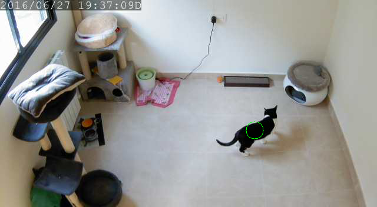
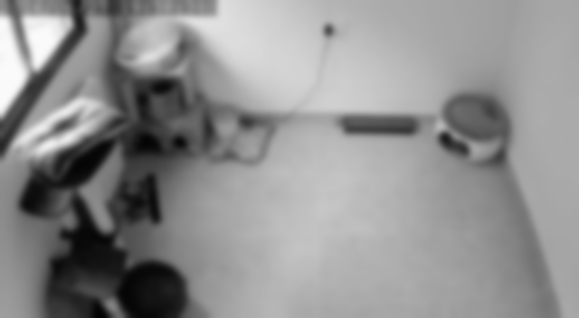
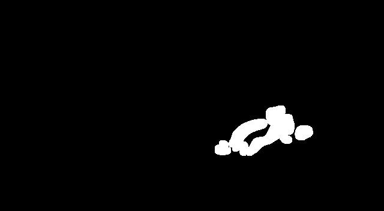

# What is THIS?

This is a IP-CAM tracker. I use it to track the movement and behaviour of my cat (his name is BMO - as in Adventure Time ). I love cats and I love gathering statistics and controlling stuff so I joined the best of the two worlds.... In Python!

Note: You can track whatever thing that moves, not only cats.

Note: This is so optimized that even runs in a Raspberry Pi 2 in real time!

# What does THIS do?

This uses your boring IP-CAM to produce an awesome surveillance device. The software connects to your IP-CAM and starts gathering images from the video-feed and processing them to detect if something is moving in the image ( [More on how the processing is achieved](#Processing) ). For each processed image it sends the coordinates of the centroid of the moving object to further processing ( this "further processing" can be for example, translating the image coordinates to named places as "In the corner of the room" ). The software detects when the moving object changed its place and stayed in the new destination for a while and then it sends you an update using Telegram...With an image!

At the end of the day, it sends you a report with how long the moving object has stayed in each place and a heatmap of the room where you can see the most visited places

#  How the IMAGE PROCESSING is done?

The processing pipeline works as follows:

* For each frame in the stream we first transform it to greyscale and blur it. This is because we do not want sharp areas of the image to interfer in the detection process. The bluring is achieved convoluting the image with a gaussian kernel ( technicisms are awesome! ). 

* We need to construct the background. We could use a static image without moving objects but that will not work because the ambient light will change among other factors. So what we do is calculate the weighted average of all the frames in the video stream as they come one by one. In this way the changing parts of the frames will be diluted in the mean and we can track all the changing properties of the static part of the image. The weight can be chosen in the configuration file.

* When we have added the image to our background we calculate the difference between our frame and this background. This can have a lot of noise ( a lot of little parts of the image will change ) so in order to clean this differenced image we will choose only the pixels that have at least certain threshold that can be chosen in the configuration file. Then we dilate this thresholded image to maximize the deletion and remove sharp edges.

* Finally in this thresholded image we calculate the centroid of the detected pixel to have some sort of "moving object position" and we yield the centroid coordinates.

# What about that TELEGRAM stuff?

Oh, thank you for asking! The reporting part of the software is achieved in the form of a Telegram bot. When started, the software instantiates a Telegram bot when provided with a KEY for the Telegram bot API and then start spamming you with images each time your cat/moving object changes position for more than 10 seconds ( this is also configurable ).

# THIS will work with my IP CAM?

As it is probably not. But we have been clever in the design! The only thing you need to change is the IP of your camera in the configuration file and the URL where your camera dumps the video stream ( read your camera documentation for this or ask in the deep abyss that Internet is ) and you are done.

# Stuff to be done

* Unity Tests
* More Unity Tests
* Async IO
* Deployement Stuff
* pip install crazy-ip-tracker
